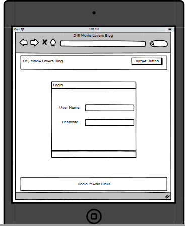
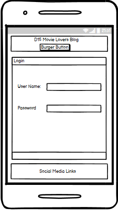
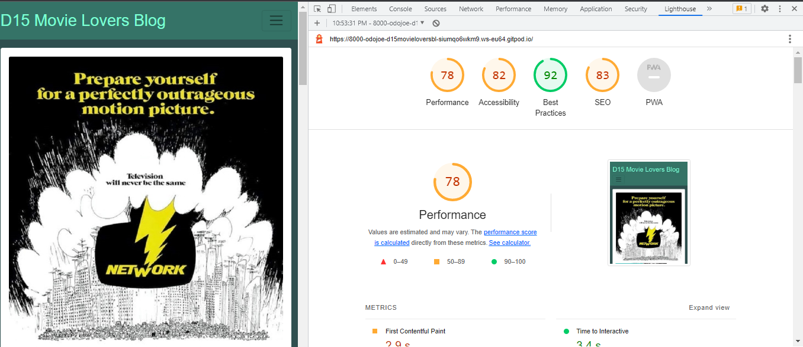
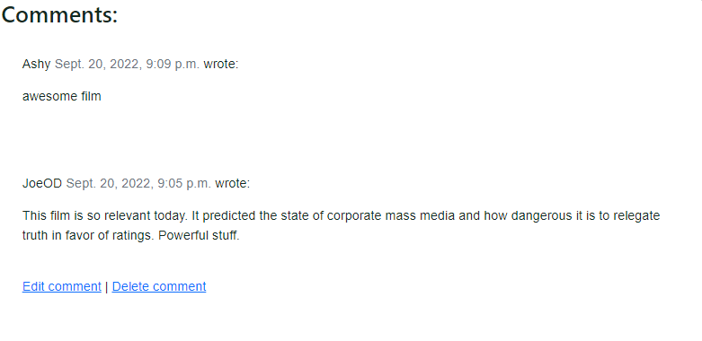
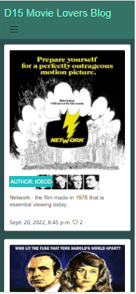

# D15 Movie Lovers Club Blog

View live site here: https://d15-movie-lovers-blog.herokuapp.com/

# Strategy

## <u>Agile</u>
* The Agile framework was applied to this project using Github views and issues tab. I created a template and applied the template to each user story.
* I collected the user stories by interviewing a family member as a mock user.
* I assembled the user stories onto a kanban board in Github under the headings 'To Do', 'In Progress' and 'Done'. Using each column effectively kept the project moving toward completion. Breaking the work up into iterations helped to reduce the enormity of the project to manageable work sessions.
* Not all user stories were effectively completed and have been retained as a baseline for improvement and adding features in the future.

## <u>Project Goal</u>
* The idea behind the D15 Movie Lovers Blog was to create a blog that can easily fit in with my previous portfolio projects: PP1 The D15 Movie Lovers Club and PP2 The D15 Movie Lovers Quiz.
* I kept the styling, colours and overall look in line with my PP1 and PP2 with a long term goal of merging the three projects together to create a viable club website with member(user) interactivity and contributions with a focus on responsive and simple design.
* I wanted Users to register, log in and log out in a simple manner while being able to read a Blog, comment on a blog and edit and delete their own comments.
* Adding a blog to the D15 movile Lovers Club is a powerful way to maintain engagement with the club and foster unity with the club members, club officials and the club presence online.
* Implement full CRUD functionality in allowing the user to write, edit and delete a comment.

## <u>Models</u>
* I used the two main models from the course content Codestar walkthrough project and added a third model the CommentValidator model. Due to the fact the CommentValidator model does not persist any values to the PostGres database it is not shown in the models below.

## <u>User Stories</u>
1. As an admin of the D15 Movie Lovers Club Blog I can approve or disapprove comments giving the admin the ability to disapprove questionable content

2. As a member of the D15 Movie Lovers Club and Blog I can access the blog on all my devices from Phone to Desktop

3. As a member of the D15 Movie Lovers Club and Blog I can recognise that the Blog page is linked to the main D15 Movie Lovers page by colour and style

4. As a member of the D15 Movie Lovers Club and Blog I can easily find and read the blog posts

5. As a member of the D15 Movie Lovers Club and Blog I can log onto the Blog with minimal fuss

6. As a member of the D15 Movie Lovers Club I can register to join the blog in a simple and accessible logon page

7. As a member of the D15 Movie Lovers Club and Blog I can vote on the monthly director's best film on a simple and accessible voting/survey box

8. As a member of the D15 Movie Lovers Club and Blog I can add suggestions to a suggestion submission box for the next monthly Director focus

9. As a member of the D15 Movie Lovers Club and Blog I can delete my comments made to Blog Posts

10. As a member of the D15 Movie Lovers Club and Blog I can edit my comments on Blog Posts

11. As a member of the D15 Movie Lovers Club and Blog I can comment on a Blog Post

## <u>Scope and structure</u>
The project scope was reduced and simplified as I approached my deadline. I decided to concentrate on coding the blog in a simple fashion with full CRUD functionality intact. 

The user stories relating to 'voting on Monthly Director's best film' and 'submitting suggestions for the next monthly director focus', while not implemented at this stage of development due to timing constraints will be added to the blog at a later date.

The blog is designed to represent the blog if it were clicked into from the main D15 Movie Lovers Club (my PP1) as another page to that project's nav bar. Once the user clicks in they are presented with up to 4 Blogs per page, which will paginate into a second page once more than 4 blogs have been written. Users can navigate to 'Home', 'Register', 'Login' and 'About'

## <u>Features</u>

* Each navigation button on the Nav Bar highlights when hovered on

* The selected page will maintain the highlighted bar to inform the user

* Navbar reduces to burger button to accomodate smaller screen sizes

* Footer in place with links to social media

* A total of 4 Blog Posts will be shown before pagination moves further Blog Posts to a new page

* Once the comment has been submitted the User also has the option to edit the comment or delete the comment

* The time of post and the number of likes wil display under each post

* The user log in will be displayed in the top right of the page until they log out

* A notification will display showing users they have logged in or logged out

* A user friendly sign in form was used to make the user experience when signing in as simple as possible

* A user friendly registration form was used to make the user experience when registering as simple as possible

* The author of the post will be displayed on the post itself

* The logout option displays for the user once they are successfully logged in

## <u>Blog Posts</u>

* The blog Posts are viewable from the main page and paginated to a new page once the number of posts hits 4 plus. The user can then click into the blog post to extend the post and read its contents. Each post is accompanied by an appropriate picture hosted in Cloudinary.

* Users will have to register using a Username, email and password to leave, edit and delete a comment. The registration process is simple and user friendly incorporating Django AllAuth.

* Five total posts have been made to the Blog to present the pagination

* The space to the right of the Blog posts was intended for the user Polling/vote interactivity. I plan to write a simple polling/vote box containing the options for Next Months Director focus and the list of films for each director giving users the ability to vote on their faourite from that director.

## <u>Future Features</u>

* As previously noted the original scope of the project included a Polling option to allow users to poll/vote on next months director focus and to vote on the current director's best film. This option will bring more interactivity to the user base increasing engagement and fostering an atmosphere of unity among the club members. I planned to write two simple poll option boxes to the right of the Blog posts on the Home Page. The top box would contain a list of 4 potential directors to vote on for the upcoming director focus in which users will click the director's name and the count for that director would increase by that vote. The second box, placed underneath the first, will contain a list of the current director's movies allowing users to vote on their favourite film and that count would increase by one. At the end of each month a follow up blog would be created to discuss the polling/vote results and hopefully garner engagement among the members in the comments.

* The eventual goal for this project is to merge it with my portfolio project 1 and portfolio project 2 and create a viable club site with interactivity to promote engagement through the D15 Movie Lovers Quiz(PP2) and through the Blog posts, comments and polling from this project.

* I also plan to develop a club logo and replace the rudimentary D15 Movie Lovers heading on each of the PP1, PP2 and PP4 projects.

* Future ambitions include adding a link to a physical media store in which users can purchase Blu Ray, DVD or 4k UHD blu Rays of their favourite movies, potentially discounting using the club profile. Also an option to add soundtracks, T-Shirts and other collectible, movie focused memorabilia.

* I plan to have the comment edits return the user to the original comment instead of back to the home page.

* I want to make the blog posts accessible when the user clicks the movie poster aswell as the blog title.

* The only blog entry to contain an original blog post written by me is the blog entry titled 'Why Jaws the Revenge is better than you think'. The other Blog entries contain copy and pasted Wikipedia entries used solely due to time constraints. I will write personal blog entries for these posts that touch on my own feelings about the individual subjects which will generate talking points for the club members in the comments section. However, should you have the time to read the Jaws the Revenge blog, I hope you give it a rewatch.

* The about page will be styled more appropriately and will include a club picture/logo. As the page stands now was simply due to time constraints.

* The empty space to the right of the home page will be used to display the voting options as previously noted

## <u>Wireframes</u>

* Home page desktop:

* Login page desktop:

* Register page desktop:

* About page desktop:

* Home page tablet:

* Login page tablet

* Register page tablet:

* About page tablet:

* Home page mobile:

* Login page mobile:

* Register page mobile:

* About page mobile:

* Blog post page desktop:

* Blog post page tablet:

* Blog post page mobile:

## <u>Differences between the Wireframes and finished blog</u>

* The poll option and vote option were not completed due to time constraints and have been noted for future implementation.

* The login and register pages were simplified. Instead of encasing the forms in a container I left them free on the page. The view is elegant and simple.

* The club logo as seen on the About page is not yet designed. This has been noted for future implementation.

* I intended a smaller blog-appropriate image would display with the full blog post however a cropped portion now displays. This has been noted for a future fix.

* I planned to display a blog-appropriate image on the mobile screen. However the responsive design works well in its current state sans image.

## <u>Design</u>

* The design focused on maintaining the look and feel of the previous D15 Movie Lovers projects (PP1 and PP2) using the same header, footer and body colours. The colour scheme, as per the previous D15 Movie Lovers projects is used to generate an emotional response to the typical muted colours associated with visiting the cinema or those nostalgic trips to the video store, walking the aisles to find your next rental, etc. The overall design is very simple to keep the screen minimalist and decluttered.

* A default image related to cinema was used as a fallback

* Sans-serif was used to keep the font simple and elegant

* I note the overall design may be considered too simple when compared to more contempory blog/club sites. My goal is to improve the design by incorporating a new club logo and refreshing the overall style.

# <u>Testing</u>

## <u>Browser Compatibility</u>
* Page loads on the most common browsers:

* Chrome:

* Firefox:

* safari - on a mobile device due to access:

# <u>Lighthouse Test</u>

* Lighthouse test desktop:

* Lighthouse test mobile:

## <u>Testing User Stories</u>

1. As an admin of the D15 Movie Lovers Club Blog I can approve or disapprove comments giving the admin the ability to disapprove questionable content:

* Goal - This User story changed during development to a more common moderator approach. If a comment has been posted with questionable content the Admin can review and delete. This is a more typical approach to blog comment management. Therefore the goal of this test is to review and remove a questionable comment.

* Action - Signed in as a user and commented on the 'Network' blog post, an arbitrary post but for the sake of the test a post that would, in a real setting, be questionable.

* Expected Outcome - As the admin I was able to review the post and delete the post from the comment thread.

* Actual Outcome - As the admin I was able to delete the comment.

* Screenshots:

* Test passed - While the Admin function differs slightly to the user story the test passed.

2. As a member of the D15 Movie Lovers Club and Blog I can access the blog on all my devices from Phone to Desktop

* Goal - The site is responsive across Moble, Tablet and Desktop devices.

* Action - Tested the site on google dev tools.

* Expected Outcome - The site would be responsive to different devices.

* Actual Outcome - The site was planned around responsive design and it is functional, neat and nicelt presented on each device.

* Screenshots:

* Test passed - Yes.

3. As a member of the D15 Movie Lovers Club and Blog I can recognise that the Blog page is linked to the main D15 Movie Lovers page by colour and style.

* Goal - Use the same colour and design as the previous PP1 and PP2 projects to fit the blog into the same style with a long term goal of merging the three projects to form one viable club page.

* Action - During development I used the same colours and style as PP1 and PP2.

* Expected Outcome - The site to give the same feel and impression as PP1 and PP2.

* Actual Outcome - The site can easily fit in with the style of PP1 and PP2.

* Test passed - Yes.

4. As a member of the D15 Movie Lovers Club and Blog I can easily find and read the blog posts.

* Goal - the user should be presented with the Blog posts on the home page, they should be easily identifiable and accessible.

* Action - A test user opened the site and was presented with the blog posts on the home page.

* Expected Outcome - Blog posts were obvious and easy to access.

* Actual Outcome - Blog posts were instantly identifiable however the access was not as straightforward as it should be. The user found it somewhat difficult to recognise clicking the Blog title would access the blog. The user expected to access the blog by clicking the movie poster. I have noted this for future improvements.

* Test passed - Partially, I would like to make accesssing the blog post by clicking the cinema poster a function in a future feature. I have noted this in the future features section.

5. As a member of the D15 Movie Lovers Club and Blog I can log onto the Blog with minimal fuss.

* Goal - The logon page is a simple, user friendly form. Users should have a simple, minimal fuss login experience each time they visit the site.

* Action - Test user logged on as username 'Ashy'.

* Expected Outcome - User had a simple and intuitive experience logging in.

* Actual Outcome - User was happy with the minimal fuss in logging in.

* Test passed - Yes.

6. As a member of the D15 Movie Lovers Club I can register to join the blog in a simple and accessible log on page

* Goal - The register/signup form is simple and user friendly. Users should have an intuitive experience registering for the site.

* Action - Test user registered under user name 'Jamie'.

* Expected Outcome - User should be happy with the simple form and quick registration process.

* Actual Outcome - User was happy with the process commenting on the ease of registering.

* Test passed - Yes.

7. As a member of the D15 Movie Lovers Club and Blog I can vote on the monthly director's best film on a simple and accessible voting/survey box.

* Goal - Users can vote on the monthly director's best film using a simple voting function, driving up interactivity with the club site.

* Action - No action. This user story was removed from the project scope during development due to time constraints.

* Expected Outcome - No outcome.

* Actual Outcome - No outcome.

* Test passed - No. This is noted for future feature development.

8. As a member of the D15 Movie Lovers Club and Blog I can add suggestions to a suggestion submission box for the next monthly Director focus.

* Goal - Users could poll or vote on the next month Director focus using a simple voting function, driving up interactivity with the club site.

* Action - No action. This user story was removed from the project scope during development due to time constraints.

* Expected Outcome - No outcome.

* Actual Outcome - No outcome.

* Test passed - No. This is noted for future feature development.

9. As a member of the D15 Movie Lovers Club and Blog I can delete my comments made to Blog Posts.

* Goal - Users can delete their own comments on Blog posts.

* Action - Test User 'Ashy' logged in, made and deleted a comment.

* Expected Outcome - Comment would be successfully deleted.

* Actual Outcome - Comment was successfully deleted.

* Test passed - Yes.

10. As a member of the D15 Movie Lovers Club and Blog I can edit my comments on Blog Posts.

* Goal - Users can edit their own comments on Blog posts.

* Action - Test User 'Ashy' logged in, made and edited a comment.

* Expected Outcome - Comment would be successfully edited.

* Actual Outcome - Comment was successfully edited.

* Test passed - Yes.

11. As a member of the D15 Movie Lovers Club and Blog I can comment on a Blog Post.

* Goal - Users can make comments on Blog posts.

* Action - Test User 'Ashy' logged in and made comments on each blog post.

* Expected Outcome - User would make the comments and they would be displayed appropriately in the comment thread under the posts.

* Actual Outcome - Comment were successfully added.

* Test passed - Yes.

## <u>Known Bugs</u>

* The create comment submission view returns to the Post Detail page without clearing the form request. As a result if the user hits refresh the form will be resubmitted and the same comment will be created again. This is a future fix.

* The comment image populates a cut off portion of the main post image. This will be redesigned in a future update to display a more complete image.

* I encountered an issue when trying to launch my project from Github - The installed programs were not recognised. Tutor support helped me to revert back to a previous work space on Gitpod. The learning is to launch the project from Gitpod.

## <u>CSS Validator</u>

## <u>HTML Validator</u>

* Please note, a stray /p tag has been introduced by the rich text box used by django to enter the post.

## <u>Python Validator</u>

## <u>Technologies Used</u>

* HTML5
* CSS
* Bootstrap
* Python
* Django
* Allauth - within Django framework
* Crispy Forms - within Django framework
* gunicorn - within Django framework
* Summernotes - within Django framework
* Cloudinary
* Heroku postgres
* Gitpod
* Github
* fontawesome
* Balsamiq - Wireframes
* W3C Validation
* W3C CSS Validation
* Pylint python Validation
* Javascript

## <u>Credits</u>
* I heavily relied on the course content walkthrough project for the Code Star blog presented by Matt Rudge. The entire project was built using the guidance of Matt's course content in particular the boostrap application and some CSS which I used from the walkthrough to help make the site responsive. My sincere thanks to Matt and his content as without it I don't think I would've completed this project.

* My wife and children for their unwavering support and patience.

* Mike Sheehan, Brian O'Grady and Matt Rudge for their helpful online meetings